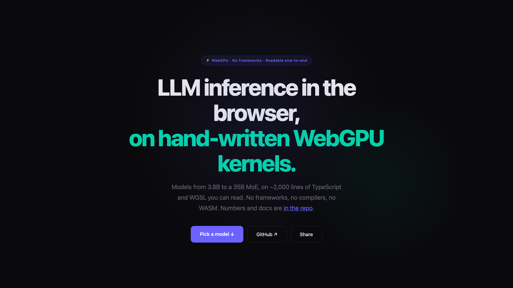

# Zero-TVM

[](https://github.com/abgnydn/zero-tvm/actions/workflows/ci.yml)
[](./LICENSE)
[](https://zerotvm.com)
[](./BENCH.md)
[](https://doi.org/10.5281/zenodo.20838918)

**[zerotvm.com](https://zerotvm.com)** — pick a model, it runs in your tab.

Zero-TVM is an LLM inference engine for the browser, written by hand in
TypeScript and WGSL. No WebLLM, no TVM, no ONNX, no WASM runtime.

- Models from a 3.8B dense to Qwen3.6-35B-A3B, a 256-expert sparse MoE
  (which WebLLM does not ship)
- int4 / int3 quantized weights, loaded by byte range, cached in the browser
- Paged KV cache, gated DeltaNet, sparse-MoE routing — in plain WGSL
- Layers validated against mlx_lm's own modules on the real checkpoints
- Benchmarked against WebLLM on identical weights, and against LM Studio on
  identical checkpoint bytes; protocol and all numbers, including withdrawn
  claims, in [BENCH.md](BENCH.md)

## Try it

Open **[zerotvm.com](https://zerotvm.com)** and pick a model. Weights stream
from HuggingFace once, then cache in your browser (OPFS); nothing ever leaves
your machine. The shipped models — sizes, RAM requirements, `?model=` flags —
are defined in
[`src/zero-tvm/model-registry.ts`](src/zero-tvm/model-registry.ts). The site's model cards render from that table.

## Quick start

```bash
npm install
npm run dev            # Vite dev server — serves every page
npm run build          # tsc && vite build → dist/
npm run check          # typecheck + unit tests
```

Weights for local dev mirror into `.weights-local/` (see
[CLAUDE.md](CLAUDE.md) for per-model download commands); the dev server serves
them at `/local-weights/` so nothing re-downloads.

## The kernels

Every shader is hand-written WGSL in
[`src/compiler/shaders/`](src/compiler/shaders/), plus one small readable
generator for the int4/int3 matmul family. There is no compiler and no autotuner. For the other side of the
argument, [`src/tvm-shaders/`](https://github.com/abgnydn/zero-tvm/tree/main/src/tvm-shaders) browses the TVM-generated
kernels WebLLM ships, captured live from a running session.

## How it's validated

Three layers, each catching what the previous cannot:

```bash
npm run test:kernels        # synthetic suite — every kernel vs a JS reference
npm run test:kernels:real   # real weights — layers vs mlx_lm's OWN modules
npm run test:kernels:mlx    # checkpoint repacking, byte-for-byte, no tolerance
```

The real-weight suite runs whole sub-blocks (gated DeltaNet, attention, the
MoE block, a full decoder layer) against the reference implementation's own
modules on the actual checkpoint, and greedy decode against `mlx_lm`'s output.
Performance claims are measured under the written protocol in
[BENCH.md](BENCH.md), including the negative results and the withdrawn pairs.

## Adding a model

Models whose blocks the kernel set already covers are added mechanically:

```bash
npm run add-model -- mlx-community/Qwen3-4B-4bit --param qwen3mlx
```

One command probes the checkpoint (10-20 MB, nearly all of it tokenizer.json,
which is fetched whole — the safetensors headers really are ranged reads), checks
it against the constraint matrix, generates the `ModelSpec`, registers it on
every surface (landing cards, switcher, `?model=` URL), and compiles every
kernel under the new dims. If the model needs a kernel that doesn't exist, the
same command says exactly which one — [docs/COMPAT.md](docs/COMPAT.md) is the
full support matrix. `scripts/validate-model.mjs` checks **fidelity**: that the
engine computes what `mlx_lm` computes on the same checkpoint, by diffing logits
and greedy decode. That is not a quality claim and cannot be one — it runs
against the SAME quantized weights, so a checkpoint quantized into gibberish
passes it. [docs/QUALITY.md](docs/QUALITY.md) demonstrates exactly that and
holds the tools that do measure quality.

## The repository as an argument

The directory layout is the narrative arc of the project. Each page is a milestone.

```
index.html      → src/landing.ts        The entrance: a character-select over the
                                        roster, cards rendered from model-registry.ts.
                                        ENTER mounts the chat in place.
zero-tvm.html   → src/zero-tvm/chat.ts  The same chat as a direct link, for
                                        deep-linking one model (?model=…).
validate.html   → src/zero-tvm/validate.ts   Multi-prompt smoke test driving
                                        engine-core.ts against local weights.
docs.html                               The annotated reference, including the
                                        kernel walkthrough and the WebLLM
                                        comparison with its withdrawn pairs.
share.html      → src/zero-tvm/share.ts Host a model for another device over
                                        WebRTC, or join a room as a guest.
```

Six pages were removed on 2026-08-14 — `architecture`, `demo`, `compiler-chat`,
`dump`, `shaders`, `webllm-bench`. Three of them started multi-gigabyte
downloads on load. `docs.html` carries what the explainers covered; the
comparison harness lives in `src/webllm-bench/` and is run from a shell.

```
src/
  zero-tvm/             THE RESULT
    engine-core.ts        THE decode engine: buildDecodeEngine,
                          allocKVPages/allocKVPagesInt8, the 32-layer decode
                          loop. No DOM. Parameterized by mode: unfused
                          reference path (validate, 9 dispatches/layer) or
                          fused QKV+RoPE+KV-append (chat, 7/layer; 8 with int8
                          KV), plus two generate styles — blocking
                          generate/forwardLogits and the pipelined readback
                          ring (generatePipelined). Driven by BOTH chat.ts
                          and validate.ts.
    chat.ts               thin chat page: DOM state, boot wiring
                          (via loading-ui's bootEngine), streaming render.
    variants.ts           URL-flag A/B harness (?sg/?matmul=/
                          ?kv8=0 …) and variant→pipeline resolution.
    markdown.ts           minimal streaming Markdown renderer.
    bench-console.ts      window.bench / benchBatched / specSim
                          devtools harnesses for the chat page.
    spec-sim.ts           CPU-side prompt-lookup speculative-decoding
                          acceptance simulator. Used to falsify a speed-up
                          experiment before building shaders.
    tokenizer.ts          BPE tokenizer from scratch
    weight-loader.ts      direct HuggingFace Phi-3-MLC fetch,
                          OPFS cache, layer-ordered streaming
    validate.ts           multi-prompt forward-pass smoke test
    loading-ui.ts         shared progress-bar UI + bootEngine
                          flow used by both chat and validate

  webllm-bench/
    main.ts               Head-to-head harness: WebLLM wired against
                          /local-weights/* so the comparison runs on identical
                          bits. See BENCH.md.

  compiler/             THE SHADERS
    compiler.ts           pipeline creation, weight buffer
                          allocation. Not an optimizing compiler — the name is
                          historical.
    shader-prelude.ts     PHI3 model constants (single source of
                          truth) rendered as a WGSL `const` prelude that is
                          injected into every shader at module creation, so no
                          model-shape literal lives inside the WGSL itself.
    shaders/              hand-written WGSL, plus a generator for the
                          int4_matmul variant family:
      add_norm.wgsl              Residual add + RMSNorm fused
      embedding.wgsl
      rms_norm.wgsl
      rope.wgsl                  (legacy, subsumed by qkv_fused)
      kv_append.wgsl             (legacy, subsumed by qkv_fused)
      kv_quantize_int8.wgsl      int8-KV path (default; ?kv8=0 opts out)
      qkv_fused.wgsl             Q/K/V proj + RoPE + paged-KV append, 1 dispatch/layer
      qkv_fused_sg.wgsl          subgroup-reduce variant (default on Apple)
      qkv_fused_scratch.wgsl     int8-KV-compatible variant (writes full V to scratch)
      qkv_fused_tiled_sg.wgsl    experimental tile variant (regressed — kept for A/B)
      qkv_fused_tiled2sg.wgsl    experimental 2-subgroup tile variant (regressed)
      attention.wgsl             Paged attention (vLLM-style page table)
      attention_sg.wgsl          subgroup-reduce variant (default on Apple)
      attention_int8.wgsl        int8-KV path (default; ?kv8=0 opts out)
      fused_ffn.wgsl             Gate + up + SiLU, fused
      fused_ffn_tiled_sg.wgsl    tile + subgroup variant
      int4_matmul.gen.ts         generator for the int4 matmul family — the 9
                                 former files differed only on {f16|f32 out} ×
                                 {1|4|8 rows/WG} × {tree|subgroup reduce} × {M=1|4};
                                 entry names are unchanged (int4_matmul, _sg,
                                 _tiled, _tiled8, _f32, _f32_sg, _f32_tiled,
                                 _f32_tiled8, _batched_m4). Every variant is
                                 still plain readable WGSL — dump them all with:
                                 node -e "import('./src/compiler/shaders/int4_matmul.gen.ts').then(m => console.log(m.debugDumpAll()))"
      argmax.wgsl
      argmax_sg.wgsl             subgroup variant

  tvm-shaders/          THE EVIDENCE — all 85 TVM-emitted WGSL kernels,
                        captured from a running WebLLM session by
                        src/dump-tvm.ts. Keep this next to compiler/shaders/
                        and the replacement is auditable.
```

`RESEARCH.md` is the writeup of how the shader capture worked and what reading TVM's output revealed about its kernel set. `BENCH.md` records the measured numbers, the head-to-head methodology, and the experiments that were falsified rather than shipped. `RESEARCH_STANDARDS.md` is the 15-principle engineering discipline this repo shares with its sibling WebGPU/WGSL research projects (webgpu-q quantum chemistry, webgpu-dna radiobiology, neuropulse LLM visualization) — single source of truth, falsifiable JSON artifacts, honest negatives, no fudge factors, shader byte-hashing, multi-level correctness.

## Measured against LM Studio

WebLLM is the obvious comparison and the one this repo started with. LM Studio
is the harder one: a native MLX runtime with no browser between it and the GPU.

Both sides load the **same files** — `.weights-local/` symlinks LM Studio's own
store, so there is one copy on disk and the only difference left is the
runtime. `lmstudio-community/Qwen3.5-9B-MLX-4bit`, ~1010-token prompt, 128
decode tokens, three interleaved rounds, medians, one M2 Max. Measured
2026-08-14, with the f16 KV cache — int8 became the native host's default on
2026-08-18 at a measured 5-8% of prefill throughput, so the prefill row would
need re-running to describe today's default.

| | zero-tvm | LM Studio | |
|---|---:|---:|---|
| cold prefix restore | ~0.4 s from disk | rebuilt each start | **~35x us** |
| prefill | 307 / 302 / 298 tok/s | 254 / 245 / 240 | **1.23x us** |
| decode | 40.4 / 42.1 / 39.9 tok/s | 43.8 / 42.8 / 42.1 | 0.94x |

**The context row is WITHDRAWN.** It read "262,144 tokens vs 198,400, 1.32x us"
and it was wrong in our favour: 262,144 is the model's native window
(`spec.maxSeq`), not what this engine allocates. `maxContext` is
`maxPages x pageSize`, and for Qwen3.5-9B that is **32,768**. The largest
context actually booted and gated here is 65,536 (qwen35). What survives is the
per-token cost below, which is structural and checkable in the spec; the
ceiling comparison needs both sides configured deliberately and re-run.

KV cost per token is structural rather than tuning: it lives on 8 of 32 layers,
so a token costs ~16 KiB with the int8 cache that is now the default (~32 KiB
under `?kv8=0`) against their ~101 KiB. That ratio is what lets a given
KV budget hold more tokens; it is not itself a measured context comparison.
The restore figure is a category difference — our prefix cache is in
OPFS and survives a reload or a crash, theirs is in RAM and ends with the
process.

### The kernels themselves are SLOWER

That table compares two runtimes. It says nothing about the shaders, so the
shaders were measured separately — one kernel per side, matched shapes,
4-bit/group-64/affine on both, the two processes alternated and paired
(`scripts/kernel-ab.mjs`):

| shape | M | ours | MLX | **MLX is** |
|---|---:|---:|---:|---:|
| ffn_gate_up | 1 | 0.240 ms | 0.202 ms | **1.19x** |
| ffn_down | 1 | 0.177 ms | 0.094 ms | **1.89x** |
| o_proj | 1 | 0.103 ms | 0.045 ms | **2.29x** |
| every shape | 256 | 5.3-5.9 TFLOP/s | ~8.2 TFLOP/s | **1.39-1.53x** |

**MLX wins every shape.** So the two results disagree in sign, and both are
real: this engine leads on prefill and sits within 6% on decode while running
kernels that are 1.4-2.3x slower. Whatever advantage it has is not kernel
speed — it is chunked prefill, the prefix cache, dispatch structure, and
whatever LM Studio spends around its own kernels.

Reproduce either half with:

```bash
MODEL=qwen35mlx LMS_MODEL=mid node --experimental-strip-types \
  scripts/lmstudio-ab.mjs --native          # runtime vs runtime
node --experimental-strip-types scripts/kernel-ab.mjs   # kernel vs kernel
```

The harness refuses to report a round that was served from either engine's
prefix cache, or a response that returned no content — each of those printed a
plausible number first, and BENCH.md records what they looked like.

## Where everything lives

| what | where |
|---|---|
| Every measured number + protocol | [BENCH.md](BENCH.md) |
| Engine documentation (per-model commands, flags, gotchas) | [CLAUDE.md](CLAUDE.md) |
| Shipped model list (the source of truth) | [`src/zero-tvm/model-registry.ts`](src/zero-tvm/model-registry.ts) |
| Reference docs + diagrams | [docs](https://zerotvm.com/docs) |
| Release history | [CHANGELOG.md](CHANGELOG.md) |

## License

MIT. See [LICENSE](LICENSE).

## Citation

This repo ships a [`CITATION.cff`](CITATION.cff), so GitHub's "Cite this
repository" button renders APA / BibTeX automatically. Each release is archived
to [Zenodo](https://zenodo.org) — cite the concept DOI
[10.5281/zenodo.20838918](https://doi.org/10.5281/zenodo.20838918) for all
versions.

```
Gunaydin, A. B. (2026). Zero-TVM: browser LLM inference on hand-written
WGSL kernels. https://zerotvm.com | https://github.com/abgnydn/zero-tvm
```
