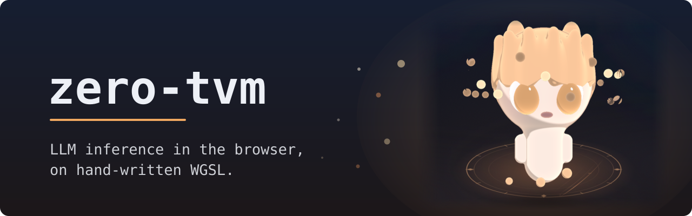

<div align="center">

<a href="https://zerotvm.com"></a>

<p align="center">
  <a href="https://zerotvm.com"></a>
</p>

<p align="center">
  <a href="https://github.com/abgnydn/zero-tvm/actions/workflows/ci.yml"></a>
  <a href="./BENCH.md"></a>
  <a href="./docs/COMPAT.md"></a>
  <a href="https://doi.org/10.5281/zenodo.20838918"></a>
  <a href="./LICENSE"></a>
</p>

<p align="center">
  <a href="https://zerotvm.com"><strong>Try it →</strong></a> ·
  <a href="https://zerotvm.com/docs"><strong>Docs</strong></a> ·
  <a href="./BENCH.md"><strong>Benchmarks</strong></a> ·
  <a href="./CHANGELOG.md"><strong>Changelog</strong></a>
</p>

<p align="center"><sub>
  <a href="#try-it">Try it</a> ·
  <a href="#quick-start">Quick start</a> ·
  <a href="#the-kernels">The kernels</a> ·
  <a href="#the-swarm">The swarm</a> ·
  <a href="#how-its-validated">How it's validated</a> ·
  <a href="#adding-a-model">Adding a model</a> ·
  <a href="#measured-against-lm-studio">vs LM Studio</a> ·
  <a href="#where-things-live">Where things live</a>
</sub></p>

</div>

# Zero-TVM

**[zerotvm.com](https://zerotvm.com)** — pick a model, it runs in your tab.

Zero-TVM is an LLM inference engine for the browser, written by hand in
TypeScript and WGSL. No WebLLM, no TVM, no ONNX, no WASM runtime.

Two things here are unusual, and they are the two sections to read first:

- **Every shader is hand-written WGSL** ([the kernels](#the-kernels)). There is
  no compiler and no autotuner. Paged KV cache, gated DeltaNet and sparse-MoE
  routing are all plain readable WGSL.
- **A model too large for one machine splits by layer range across several**
  ([the swarm](#the-swarm)). Each device holds only its own layers and its own
  KV; a token's hidden state hops device to device over WebRTC; a guest with
  the room link just chats.

The rest of the shape:

- Models from a 1B dense up to Qwen3.6-35B-A3B, a sparse MoE of 256 experts
  routed top-8 plus a shared expert — and the first model here with no WebLLM
  build to benchmark it against
- int4 / int3 quantized weights, loaded by byte range, cached in the browser
- Layers validated against `mlx_lm`'s own modules on the real checkpoints
- Benchmarked against WebLLM on identical weights, and against LM Studio on
  identical checkpoint bytes; protocol and all numbers, including withdrawn
  claims, in [BENCH.md](BENCH.md)

## Try it

Open **[zerotvm.com](https://zerotvm.com)** and pick a model. Weights stream
from HuggingFace once, then cache in your browser (OPFS). In a single tab
nothing leaves your machine — no prompt is sent to a server. The shipped models
— sizes, RAM requirements, `?model=` flags — are defined in
[`src/zero-tvm/model-registry.ts`](src/zero-tvm/model-registry.ts); the site's
model cards render from that table, so what you see on the entrance and what
the engine allocates cannot disagree.

## Quick start

```bash
npm install
npm run dev            # Vite dev server — serves every page
npm run build          # tsc && vite build → dist/
npm run check          # typecheck + unit tests
```

Weights for local dev mirror into `.weights-local/` (see
[CLAUDE.md](CLAUDE.md) for per-model download commands); the dev server serves
them at `/local-weights/` so nothing re-downloads.

## The kernels

Every shader is hand-written WGSL in
[`src/compiler/shaders/`](src/compiler/shaders/), plus one small readable
generator for the int4/int3 matmul family. There is no compiler and no
autotuner — `src/compiler/compiler.ts` creates pipelines, and the name is
historical.

The engine is **spec-parameterized**: layer count, head shape and block kinds
all come from `src/compiler/model-spec.ts`, so one decode loop
(`src/zero-tvm/engine-core.ts`) serves a 1B dense model, a 64-layer
attention/DeltaNet hybrid and a 256-expert sparse MoE.
No model-shape literal lives inside the WGSL: `shaderPrelude(spec)`
injects the constants at module creation.

For the other side of the argument,
[`src/tvm-shaders/`](https://github.com/abgnydn/zero-tvm/tree/main/src/tvm-shaders)
holds the TVM-generated kernels WebLLM ships, captured live from a running
session by `src/dump-tvm.ts`. Keeping the two directories side by side is what
makes the replacement auditable.

## The swarm

A model that does not fit on one machine is cut into **layer ranges**, one
machine per range.
`buildDecodeEngine(..., { layerRange: { start, end } })` builds ONE stage: no
embedding when `start > 0`, no final norm / LM head / argmax when
`end < layers`, and bind groups only for the layers in range.
`loadWeights(..., spec, { start, end })` follows the same range, so a stage
never downloads the layers it does not hold. Each stage keeps the KV cache and
the recurrent (GDN) state of **its own** layers.

A token's hidden state then hops device to device. The first stage takes the
token id and produces a residual; each stage passes the residual on over a
WebRTC DataChannel; the stage holding the last layers sends back a token id.
The hand-off is the **bare residual** — one hidden-state vector, a few KB per
token — because every stage re-normalises with its own first layer's gamma and
needs no weight from its neighbour. The reply's *type* says where in the chain
the sender sits (binary means "a residual, still going"; text means "here is
the token"), so nothing has to be told how long the chain is and stages can
join in any order. The host refuses to serve until the assembled chain tiles
the whole model.

A **guest** with the room link just chats. It needs no WebGPU, downloads
nothing, and learns the model's identity over the channel — it renders with
the same `chat-ui.ts` surface as the chat page, which is why the two cannot
drift. Prompts and tokens ride the DataChannel, which WebRTC always
DTLS-encrypts; the Cloudflare Durable Object at
[`workers/share-signal/`](workers/share-signal/) relays SDP/ICE only. The room
id is 128 random bits in the link *fragment*, and browsers do not send
fragments over HTTP, so the static host never sees it. The engine is
single-stream, so guest requests are serialized — the rest are told their queue
position, and the host tab shows every request as it arrives.

The entrance builds the links for you: on
**[zerotvm.com](https://zerotvm.com/#swarm)**, pick a model that can be split
and press *Too big for one machine? Split it* under the enter buttons.

### The URL grammar — the query goes BEFORE the fragment

```
share.html?model=X                   HOST    opens a room serving the whole model
share.html?model=X&layers=0-k        HOST    opens a room, holds the first layers
share.html?model=X&layers=k-N#<room> HELPER  joins that room, holds the rest
share.html#<room>                    GUEST   chats; runs nothing locally
```

**Writing the query after the fragment is not an error — it silently starts a
NEW room.** `share.html#<room>?model=X&layers=k-N` is the order a URL bar
autocompletes into if you paste the room link and then type. It leaves
`location.search` empty and `location.hash` no longer matching a room id, so
the page falls through to the HOST branch and opens a brand-new room. Two
machines then sit in two rooms waiting for each other, with nothing on either
screen saying why. That cost a real user an hour.

One parser, [`src/zero-tvm/room-url.ts`](src/zero-tvm/room-url.ts), decides the
role; `share.ts` routes on it and the entrance's link builder generates from
it, so a URL the site hands out cannot be read as another role.
[`tests/unit/room-url.test.ts`](tests/unit/room-url.test.ts) feeds every
generated URL back through `roleFor()` and asserts the role it was labelled
with — including the query-after-fragment case.

A room holds **many** hosts. `?model=X#<room>` serves an existing room from
this device, which is how a room grows into a swarm: the relay assigns each
guest to the least-loaded host and reassigns its guests when a host's tab
closes. The guest rebuilds its peer connection and keeps the conversation —
history lives on the guest, and a host is stateless between requests.

### Weights move device to device too

[`src/zero-tvm/peer-weights.ts`](src/zero-tvm/peer-weights.ts) replicates the
host's weight cache to a peer over a second DataChannel, so a second machine
never re-downloads from HuggingFace what the first one already has. The unit
of replication is the model's **OPFS directory**, not the checkpoint — whatever
the loader cached lands as flat files there, so MLC shards and MLX built
buffers both replicate with the loader untouched, and the receiving tab boots
from cache never learning the bytes came from a peer. Pieces are 240 KB, so a
framed message stays under the ~256 KB every WebRTC implementation accepts
without negotiating `maxMessageSize`, and each carries a SHA-256 the receiver
checks.

**What the hash is for:** it catches transport corruption and a peer that
silently truncates. It does NOT make a dishonest host safe — the sender
computes it. That is deliberate: this runs inside a room where you already
trust the host to run the model, since the host could return any tokens it
liked. An open swarm with strangers needs a manifest from an independent
source, which is a different design.

### The limits, in the same breath

- **STUN only, no TURN relay.** Same network, or an ordinary home router,
  connects directly. Corporate and hotel networks usually will not. TURN is a
  separate deployment *and* a separate consent — it routes ciphertext through a
  third party.
- **Splitting needs an MLX checkpoint.** `loadWeights` throws on a `layerRange`
  against an MLC one, because the MLC path fetches whole shards and skipping
  layers would save no download. `canSplitAcrossDevices()` in the registry is
  what the entrance's builder filters on, so the site never offers a link that
  would throw at boot.
- **Latency is the round trip, not the bandwidth.** A few KB per token is
  nothing for any link, but the hop is serial with decode: the next token
  cannot start until the previous one came back. On a LAN that is a modest tax;
  over the open internet it dominates. This is for machines you own on one
  network, not volunteers across the world.
- **A backgrounded host is throttled hard** by the browser, at both serving and
  generating. Both serving roles carry a "keep this tab awake" toggle (screen
  wake-lock plus a silent audio track) — a helper especially, since it is a
  background tab for its whole life. The browser shows its audio indicator,
  which is the honest label for it.

```bash
node scripts/pipeline-split-test.mjs --ref /tmp/ref-llama32 llama32
                                        # a split reproduces the whole model, token for token
node scripts/room-routing-test.mjs      # multi-host routing, plain WebSockets, no browser
node scripts/split-serve-e2e.mjs        # two Chrome profiles, real WebRTC
node scripts/peer-weights-e2e.mjs       # two browser profiles, a real replication
```

Do NOT test routing by booting two engines in one browser: two full models on
one GPU hangs long before it proves anything about routing. That is why the
routing test speaks plain WebSockets.

## How it's validated

Three layers, each catching what the previous cannot:

```bash
npm run test:kernels        # synthetic suite — every kernel vs a JS reference
npm run test:kernels:real   # real weights — layers vs mlx_lm's OWN modules
npm run test:kernels:mlx    # checkpoint repacking, byte-for-byte, no tolerance
```

The real-weight suite runs whole sub-blocks (gated DeltaNet, attention, the
MoE block, a full decoder layer) against the reference implementation's own
modules on the actual checkpoint, and greedy decode against `mlx_lm`'s output.
Performance claims are measured under the written protocol in
[BENCH.md](BENCH.md), including the negative results and the withdrawn pairs.

The doctrine is [docs/VERIFICATION.md](docs/VERIFICATION.md), and its top rule
is the only line worth memorising: **something that looks like a check is not a
check.** Every defect that reached a user in this repo was silent — fluent
wrong output, never a crash — so `node scripts/mutation-gate.mjs` re-checks
that the suite still fails on bugs that actually shipped.

## Adding a model

Models whose blocks the kernel set already covers are added mechanically:

```bash
npm run add-model -- mlx-community/Qwen3-4B-4bit --param qwen3mlx
```

That one command probes the checkpoint, checks it against the constraint
matrix, generates the `ModelSpec`, registers it on every surface — landing
card, switcher, `?model=` flag — and compiles every kernel under the new
dimensions. If the model needs a kernel that does not exist, it says which one;
[docs/COMPAT.md](docs/COMPAT.md) is the full support matrix.

The probe downloads 10–20 MB, nearly all of it `tokenizer.json`. The
safetensors headers really are ranged reads.

Then verify it numerically:

```bash
node scripts/validate-model.mjs qwen3mlx --ref /tmp/ref-qwen3mlx
```

This checks **fidelity** — that the engine computes what `mlx_lm` computes on
the same checkpoint — by diffing logits and greedy decode. It is not a quality
claim and cannot be one: it runs against the *same quantized weights*, so a
checkpoint quantized into gibberish passes it.
[docs/QUALITY.md](docs/QUALITY.md) demonstrates precisely that, and holds the
tools that do measure quality.

## Measured against LM Studio

WebLLM is the obvious comparison and the one this repo started with. LM Studio
is the harder one: a native MLX runtime with no browser between it and the GPU.

Both sides load the **same files** — `.weights-local/` symlinks LM Studio's own
store, so there is one copy on disk and the only difference left is the
runtime. `lmstudio-community/Qwen3.5-9B-MLX-4bit`, ~1010-token prompt, 128
decode tokens, three interleaved rounds, medians, one M2 Max. Measured
2026-08-14, with the f16 KV cache — int8 became the native host's default on
2026-08-18 at a measured 5-8% of prefill throughput, so the prefill row would
need re-running to describe today's default.

| | zero-tvm | LM Studio | |
|---|---:|---:|---|
| prefill | 307 / 302 / 298 tok/s | 254 / 245 / 240 | **1.23x us** |
| decode | 40.4 / 42.1 / 39.9 tok/s | 43.8 / 42.8 / 42.1 | 0.94x |

**The context row is WITHDRAWN.** It read "262,144 tokens vs 198,400, 1.32x us"
and it was wrong in our favour: 262,144 is the model's native window
(`spec.maxSeq`), not what this engine allocates. `maxContext` is
`maxPages x pageSize`, and for Qwen3.5-9B that is **32,768**. The largest
context actually booted and gated here is 65,536 (qwen35). What survives is the
per-token cost below, which is structural and checkable in the spec; the
ceiling comparison needs both sides configured deliberately and re-run.

KV cost per token is structural rather than tuning: it lives on 8 of 32 layers,
so a token costs ~16 KiB with the int8 cache that is now the default (~32 KiB
under `?kv8=0`) against their ~101 KiB. That ratio is what lets a given KV
budget hold more tokens; it is not itself a measured context comparison.

The prefix cache is a category difference rather than a ratio: ours lives in
OPFS and survives a reload, a crash or a model switch, theirs is RAM-resident
and ends with the process. Within this engine, a 20k-token prefix costs ~99 s
to re-prefill and 0.36 s to restore — read the caveats in BENCH.md's KV-paging
section before quoting that, since the OPFS side was measured warm. No
cross-runtime restore ratio has been measured under a written protocol, and an
earlier "~35x" one has been removed for that reason.

### The kernels themselves are SLOWER

That table compares two runtimes. It says nothing about the shaders, so the
shaders were measured separately — one kernel per side, matched shapes,
4-bit/group-64/affine on both, the two processes alternated and paired
(`scripts/kernel-ab.mjs`):

| shape | M | ours | MLX | **MLX is** |
|---|---:|---:|---:|---:|
| ffn_gate_up | 1 | 0.240 ms | 0.202 ms | **1.19x** |
| ffn_down | 1 | 0.177 ms | 0.094 ms | **1.89x** |
| o_proj | 1 | 0.103 ms | 0.045 ms | **2.29x** |
| every shape | 256 | 5.3-5.9 TFLOP/s | ~8.2 TFLOP/s | **1.39-1.53x** |

**MLX wins every shape.** So the two results disagree in sign, and both are
real: this engine leads on prefill and sits within 6% on decode while running
kernels that are 1.4-2.3x slower. Whatever advantage it has is not kernel
speed — it is chunked prefill, the prefix cache, dispatch structure, and
whatever LM Studio spends around its own kernels.

Reproduce either half with:

```bash
MODEL=qwen35mlx LMS_MODEL=mid node --experimental-strip-types \
  scripts/lmstudio-ab.mjs --native          # runtime vs runtime
node --experimental-strip-types scripts/kernel-ab.mjs   # kernel vs kernel
```

The harness refuses to report a round that was served from either engine's
prefix cache, or a response that returned no content — each of those printed a
plausible number first, and BENCH.md records what they looked like.

## Where things live

The directory layout is the narrative arc of the project; each page is a
milestone.

| page | module | what it is |
|---|---|---|
| `index.html` | `src/landing.ts` | The entrance: a character-select over the roster, cards rendered from `model-registry.ts`. ENTER mounts the chat in place. `src/landing-swarm.ts` is the swarm: a second mode of the same screen, which turns the stat sheet into the link builder. |
| `zero-tvm.html` | `src/zero-tvm/chat.ts` | The same chat as a direct link, for deep-linking one model (`?model=…`). |
| `share.html` | `src/zero-tvm/share.ts` | Host, help or join a room — [the swarm](#the-swarm). |
| `validate.html` | `src/zero-tvm/validate.ts` | Multi-prompt smoke test driving `engine-core.ts` against local weights. |
| `agent-host.html` | `src/zero-tvm/agent-host.ts` | The local agent-server surface: an OpenAI-shaped front door so pi and Cline can drive the engine (`npm run agent`). |
| `docs.html` | — | The annotated reference, including the kernel walkthrough and the WebLLM comparison with its withdrawn pairs. |

```
src/
  zero-tvm/             THE RESULT — the hand-written engine
    engine-core.ts        THE decode loop. buildDecodeEngine, KV allocation, the
                          pipelined readback ring, layerRange stages. No DOM —
                          every surface above drives this one file.
    chat-flow.ts          the turn loop, shared by the chat page and the entrance
    model-registry.ts     the single source for ?model= flags, landing cards, the
                          switcher, and every figure they display
    weight-loader.ts      MLC layout: HuggingFace fetch, OPFS cache, layer-ordered
                          streaming
    weight-loader-mlx.ts  MLX layout: byte-RANGE reads out of multi-GB safetensors
                          shards. Most of the roster loads here, and it is the
                          format a layerRange split requires.
    share.ts              the three room roles — with room-host.ts (the host loop),
                          room-url.ts (the URL grammar), pipeline-peer.ts (the
                          residual wire) and peer-weights.ts (cache replication)
    tokenizer-bpe.ts      byte-level BPE and the chat templates, including the
                          ChatML generations that disagree about whitespace and
                          about which past turns keep a <think> block
    variants.ts           URL-flag A/B harness (?sg=0, ?matmul=, ?kv8=0 …)

  compiler/             THE SHADERS — model-spec.ts, the pipeline builder, and
                        shaders/, the hand-written WGSL. Dump every generated
                        int4 matmul variant with:
                        node -e "import('./src/compiler/shaders/int4_matmul.gen.ts').then(m => console.log(m.debugDumpAll()))"
  tvm-shaders/          THE EVIDENCE — the TVM-emitted WGSL WebLLM ships, captured
                        from a running session. Next to compiler/shaders/, the
                        replacement is auditable.
  webllm-bench/         head-to-head harness: WebLLM wired against /local-weights/*
                        so the comparison runs on identical bits
```

[CLAUDE.md](CLAUDE.md) carries the per-module detail, the per-model commands,
and the known gaps.

| what | where |
|---|---|
| Every measured number + protocol | [BENCH.md](BENCH.md) |
| Engine documentation (per-model commands, flags, gotchas) | [CLAUDE.md](CLAUDE.md) |
| Shipped model list (the source of truth) | [`src/zero-tvm/model-registry.ts`](src/zero-tvm/model-registry.ts) |
| Reference docs + diagrams | [docs](https://zerotvm.com/docs) |
| How this project verifies itself | [docs/VERIFICATION.md](docs/VERIFICATION.md) |
| Support matrix (what a new model needs) | [docs/COMPAT.md](docs/COMPAT.md) |
| Quality vs fidelity, and the tools that measure quality | [docs/QUALITY.md](docs/QUALITY.md) |
| How the TVM shader capture worked, and what it revealed | [RESEARCH.md](RESEARCH.md) |
| The 15-principle discipline shared with the sibling WebGPU projects | [RESEARCH_STANDARDS.md](RESEARCH_STANDARDS.md) |
| Release history | [CHANGELOG.md](CHANGELOG.md) |

## License

MIT. See [LICENSE](LICENSE).

## Citation

This repo ships a [`CITATION.cff`](CITATION.cff), so GitHub's "Cite this
repository" button renders APA / BibTeX automatically. Each release is archived
to [Zenodo](https://zenodo.org) — cite the concept DOI
[10.5281/zenodo.20838918](https://doi.org/10.5281/zenodo.20838918) for all
versions.

```
Gunaydin, A. B. (2026). Zero-TVM: browser LLM inference on hand-written
WGSL kernels. https://zerotvm.com | https://github.com/abgnydn/zero-tvm
```
